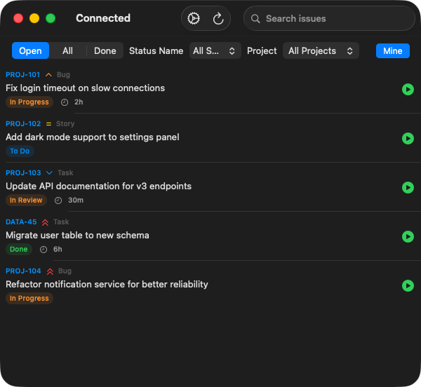
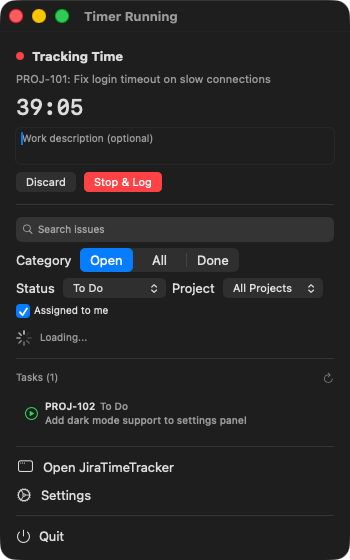
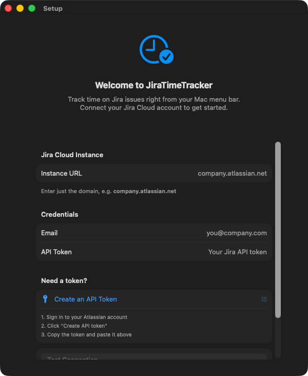
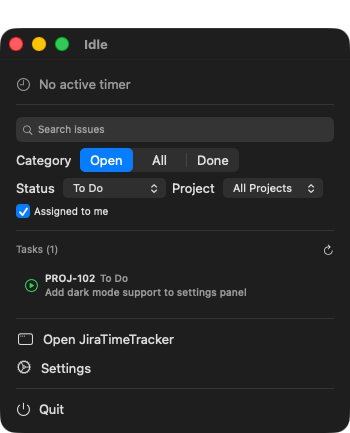
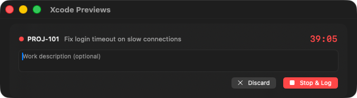

# JiraTimeTracker

A lightweight macOS menu bar app for tracking time on Jira issues and logging work directly to Jira Cloud.


<p align="center">
  
  &nbsp;&nbsp;
  
</p>

## Features

- **Menu bar timer** — Start, stop, and log time without leaving your current workflow
- **Full window view** — Browse and filter all your Jira issues
- **One-click time logging** — Logs hours directly to Jira with optional work descriptions
- **Desktop widgets** — See your active timer and open tasks at a glance
- **Smart filters** — Filter by project, status, and assignee
- **Secure** — Credentials stored in macOS Keychain

## Installation

### Download

1. Go to [Releases](../../releases)
2. Download **JiraTimeTracker.pkg** (or `.zip` if you prefer)
3. Open the `.pkg` and follow the installer — or unzip and drag the app to `/Applications`

> **Note:** Since the app isn't signed with an Apple Developer certificate, macOS will block it the first time. Right-click the app → **Open** → click **Open** in the dialog. You only need to do this once.

### Build from source

```bash
git clone https://github.com/danbasnett/JiraTimeTracker.git
cd JiraTimeTracker
./scripts/build-release.sh
```

The built `.pkg` and `.zip` will be in the `build/` directory.

## Setup

JiraTimeTracker connects to **Jira Cloud** (Atlassian-hosted). You need three things:

| Field | Example | Where to find it |
|-------|---------|-----------------|
| **Instance URL** | `company.atlassian.net` | Your Jira URL bar |
| **Email** | `you@company.com` | Your Atlassian account email |
| **API Token** | `ATATT3x...` | See below |

### Getting an API token

1. Go to [https://id.atlassian.net/manage-profile/security/api-tokens](https://id.atlassian.net/manage-profile/security/api-tokens)
2. Click **Create API token**
3. Give it a label (e.g. "JiraTimeTracker")
4. Copy the token

> There's also a direct link to this page in the app's Settings.

### First launch

1. Open **JiraTimeTracker** — a setup screen will appear
2. Enter your Instance URL, Email, and API Token
3. Click **Test Connection** to verify
4. Click **Save & Connect**

That's it. Your issues will load and the menu bar icon (clock) will appear.

<p align="center">
  
</p>

## Usage

### Menu bar

Click the **clock icon** in your menu bar to:

- See your active timer
- Browse and search issues
- Start a timer on any issue
- Stop and log time with a work description
- Filter by project, status, or assignee

<p align="center">
  
  &nbsp;&nbsp;
  
</p>

### Main window

Open the full window from the menu bar or by clicking the app icon. The main window provides:

- **Search** — Full-text search across issue summaries
- **Filters** — Open / All / Done status categories, specific status names, projects, and "Mine" toggle
- **Timer controls** — Start/stop timers, add work descriptions, discard or log

When a timer is running, it appears at the top of the window:

<p align="center">
  
</p>

### Timer workflow

1. Click the **play button** on any issue to start tracking
2. Optionally add a **work description** (this becomes the worklog comment in Jira)
3. Click **Stop & Log** to submit the time to Jira
4. Or click **Discard** to cancel without logging

> Time must be at least 1 minute to log (Jira requirement).

### Widgets

Add widgets to your desktop via **Edit Widgets** in Notification Center:

- **Jira Timer** — Shows the currently active timer with elapsed time
- **Jira Tasks** — Shows your open issue count and recent issues

### Settings

Access settings from:
- The **gear icon** in the toolbar
- The menu bar → **Settings**
- macOS menu → **JiraTimeTracker** → **Settings** (⌘,)

## How it works

- Connects to [Jira Cloud REST API v3](https://developer.atlassian.com/cloud/jira/platform/rest/v3/) using Basic Auth (email + API token)
- Credentials are stored securely in macOS **Keychain**
- Timer state persists across app restarts via UserDefaults
- Widget data shared via App Groups (`group.danbasnett.JiraTimeTracker`)
- All communication is HTTPS to your Jira instance — no other external connections

## Requirements

- macOS 14.0 (Sonoma) or later
- A Jira Cloud account (Atlassian-hosted)

## Troubleshooting

### "Connection failed" error
- Make sure you're using just the domain (e.g. `company.atlassian.net`), not a full URL
- Verify your API token is correct — tokens can't be viewed after creation, so create a new one if unsure
- Check that your Atlassian account has access to the Jira instance

### No issues showing up
- Check your filters — try setting status to "All" and unchecking "Mine"
- Click the refresh button (↻) in the toolbar
- Make sure you have permission to view issues in your Jira project

### Menu bar icon not appearing
- The clock icon appears after first launch. If you don't see it, check if it's hidden behind the notch or other menu bar items
- Try quitting and reopening the app

### Widget not updating
- Widgets refresh approximately every minute
- Make sure the app is running (check for the clock icon in your menu bar)

## License

MIT
